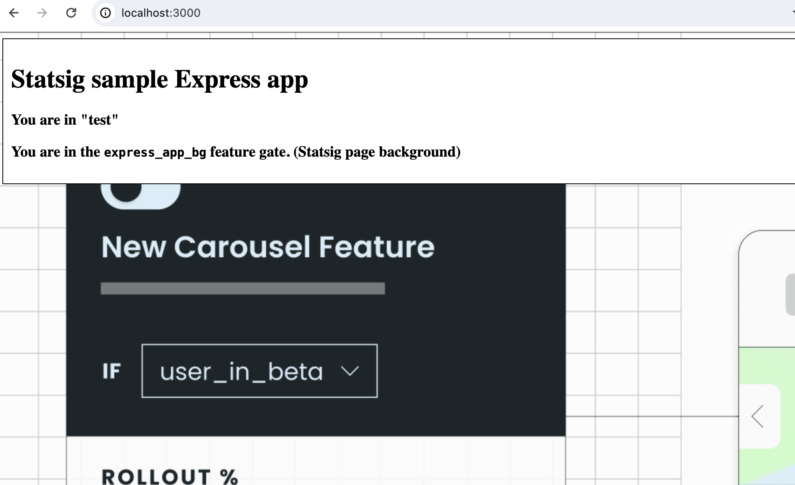

# Node Express Statsig Demo App

This sample app shows how to integrate Statsig's [Node SDK](https://docs.statsig.com/server/nodejsServerSDK) into an Express app 

### Outline
* Code lives in [app.js](./app.js) - This is where express is initialized and route handler lives
* The app defines global middleware for managing a uuid cookie used as a Unit ID with the [Statsig User Object](https://docs.statsig.com/server/concepts/user)
* The `/` route will assign you to a test and a feature gate and render the page accordingly.
* You should create a `.env` file with `STATSIG_SERVER_KEY=YOUR-KEY` or run the process with the that environment variable set. 

### Running the app
Running this on the CLI will start the all at `http://localhost:3000/`
`npm start` or `npm run dev` for live reloads

